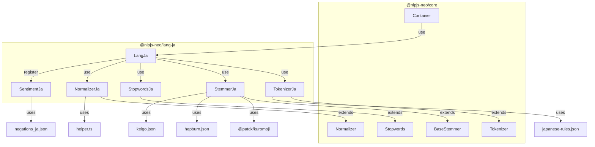
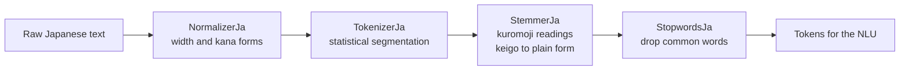

# @nlpjs-neo/lang-ja

Japanese language support for NLP.js Neo. The package provides the components the NLP
pipeline needs to process Japanese text: a normalizer, a tokenizer, a stemmer, a stopword
list and the sentiment configuration.

## Table of contents

- [Installation](#installation)
- [Quick start](#quick-start)
- [Architecture](#architecture)
- [Modules](#modules)
- [Character types](#character-types)

## Installation

```bash
pnpm add @nlpjs-neo/lang-ja
```

The package depends on `@nlpjs-neo/core` and on
[`@patdx/kuromoji`](https://github.com/patdx/kuromoji.js), a maintained fork of the
[kuromoji.js](https://github.com/takuyaa/kuromoji.js) morphological analyzer. The IPADIC
dictionary ships inside `@patdx/kuromoji`, so nothing else has to be downloaded. It requires
Node.js 22.12 or later and is ESM only.

## Quick start

### With a container

Register `LangJa` and every component is wired for you.

```js
import { Container } from '@nlpjs-neo/core';
import { LangJa } from '@nlpjs-neo/lang-ja';

const container = new Container();
container.use(LangJa);

const normalizer = container.get('normalizer-ja');
const tokenizer = container.get('tokenizer-ja');
const stemmer = container.get('stemmer-ja');
const stopwords = container.get('stopwords-ja');
```

To use it through the `nlp` package, add the plugin and the language:

```js
import { containerBootstrap } from '@nlpjs-neo/core';
import { Nlp } from '@nlpjs-neo/nlp';
import { LangJa } from '@nlpjs-neo/lang-ja';

const container = await containerBootstrap();
container.use(Nlp);
container.use(LangJa);

const nlp = container.get('nlp');
nlp.addLanguage('ja');
```

### Standalone

Every component can be used without a container.

```js
import { NormalizerJa, TokenizerJa } from '@nlpjs-neo/lang-ja';

const normalizer = new NormalizerJa();
const tokenizer = new TokenizerJa();

const tokens = tokenizer.tokenize(normalizer.normalize('一般的にコーヌビアナイトと呼ばれる変成岩。'));
// ['一般的', 'に', 'コーヌビアナイト', 'と', '呼ばれる', '変成', '岩']
```

## Architecture



### Processing pipeline



`TokenizerJa` and `StemmerJa` are two independent ways of splitting a text. The tokenizer is a
small dictionary-free model, and the stemmer parses with kuromoji and answers the katakana
reading of each word.

## Modules

| Module                         | Class          | Container key   | Description                                                      |
| ------------------------------ | -------------- | --------------- | ---------------------------------------------------------------- |
| [normalizer.md](normalizer.md) | `NormalizerJa` | `normalizer-ja` | Width, kana and compatibility-symbol normalization               |
| [tokenizer.md](tokenizer.md)   | `TokenizerJa`  | `tokenizer-ja`  | Statistical word segmentation                                    |
| [stemmer.md](stemmer.md)       | `StemmerJa`    | `stemmer-ja`    | Morphological analysis, readings, romaji and keigo normalization |
| [stopwords.md](stopwords.md)   | `StopwordsJa`  | `stopwords-ja`  | Japanese stopword list                                           |
| [sentiment.md](sentiment.md)   | `SentimentJa`  | `sentiment-ja`  | Sentiment configuration and negations                            |

## Character types

The tokenizer sorts each character into one of these classes, and the segmentation model is
trained on them.

| Code | Category       | Matches                        | Examples       |
| ---- | -------------- | ------------------------------ | -------------- |
| `M`  | Kanji numerals | `〇一二三四五六七八九十百千万億兆` | 三、百         |
| `H`  | Kanji          | U+4E00 to U+9FCC, and `〆`     | 変成岩、一般的 |
| `I`  | Hiragana       | U+3041 to U+309F               | あいうえお     |
| `K`  | Katakana       | U+30A0 to U+30FF               | アイウエオ     |
| `A`  | Latin          | `a-z`, `A-Z`                   | abc, NLP       |
| `N`  | Digit          | `0-9`                          | 123            |
| `O`  | Other          | anything else                  | punctuation    |
