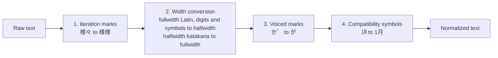

# NormalizerJa

|                   |                                  |
| ----------------- | -------------------------------- |
| **Class**         | `NormalizerJa`                   |
| **Extends**       | `Normalizer` (`@nlpjs-neo/core`) |
| **Container key** | `normalizer-ja`                  |
| **File**          | `src/normalizer-ja.ts`           |

Puts Japanese text in one canonical form before it is tokenized, so the same word written in
different widths or with composed and decomposed kana is seen as one. Unlike the core
normalizer it does not lowercase or strip accents.

## Transformations

`normalize` applies four steps in order.



### 1. Iteration marks

The mark `々` (U+3005) repeats the character before it. It is expanded so the tokenizer sees
ordinary kanji.

| Pattern    | Result                    | Example                |
| ---------- | ------------------------- | ---------------------- |
| `(..)々々` | the two characters, twice | `様様々々` → `様様様様` |
| `(.)々`    | the character, twice      | `様々` → `様様`         |

### 2. Width conversion

The tables are built in `src/helper.ts`.

- Fullwidth Latin letters become halfwidth: `ＮＬＰ` → `NLP`, and the ideographic space `　`
  becomes a plain space.
- Fullwidth digits become halfwidth: `１２３` → `123`.
- Fullwidth symbols become halfwidth: `！` → `!`, `（` → `(`.
- Halfwidth katakana become fullwidth: `ｱｲｳ` → `アイウ`.

### 3. Voiced marks

A kana followed by a separate voiced mark `゛` or semi-voiced mark `゜` is joined into the
single character.

| Input  | Output | Note                                               |
| ------ | ------ | -------------------------------------------------- |
| `か゛` | `が`   | voiced                                             |
| `は゛` | `ば`   | voiced                                             |
| `は゜` | `ぱ`   | semi-voiced                                        |
| `ウ゛` | `ヴ`   | katakana                                           |
| `っな` | `んな` | also `っに`, `っぬ`, `っね`, `っの` and the katakana |

Every hiragana and katakana of the k, s, t and h rows is covered.

### 4. Compatibility symbols

Single characters that stand for a group of characters are expanded.

| Input | Output     | Group                         |
| ----- | ---------- | ----------------------------- |
| `㋀`  | `1月`      | months (`㋀` to `㋋`)         |
| `㏠`  | `1日`      | days (`㏠` to `㏾`)           |
| `㍘`  | `0点`      | hours (`㍘` to `㍰`)          |
| `㍻`  | `平成`     | eras, and `㍿` for `株式会社` |
| `㌀`  | `アパート` | squared katakana units        |

## API

### `normalize(text)`

Returns the normalized text.

```js
import { NormalizerJa } from '@nlpjs-neo/lang-ja';

const normalizer = new NormalizerJa();

normalizer.normalize('東京は様々な場所です。'); // '東京は様様な場所です。'
normalizer.normalize('ＮＬＰはとても面白い！'); // 'NLPはとても面白い!'
normalizer.normalize('か゛さ゛は゛は゜ウ゛'); // 'がざばぱヴ'
normalizer.normalize('ｱｲｳ　１２３'); // 'アイウ 123'
```

### `run(input)`

The pipeline step. It reads `input.text`, replaces it with the normalized text and returns the
input.

```js
normalizer.run({ text: 'ＮＬＰは面白い' });
// { text: 'NLPは面白い' }
```

## Usage

Normalize first, then tokenize:

```js
import { NormalizerJa, TokenizerJa } from '@nlpjs-neo/lang-ja';

const normalizer = new NormalizerJa();
const tokenizer = new TokenizerJa();

const tokens = tokenizer.tokenize(normalizer.normalize(inputText));
```

---

← [Back to overview](index.md)
