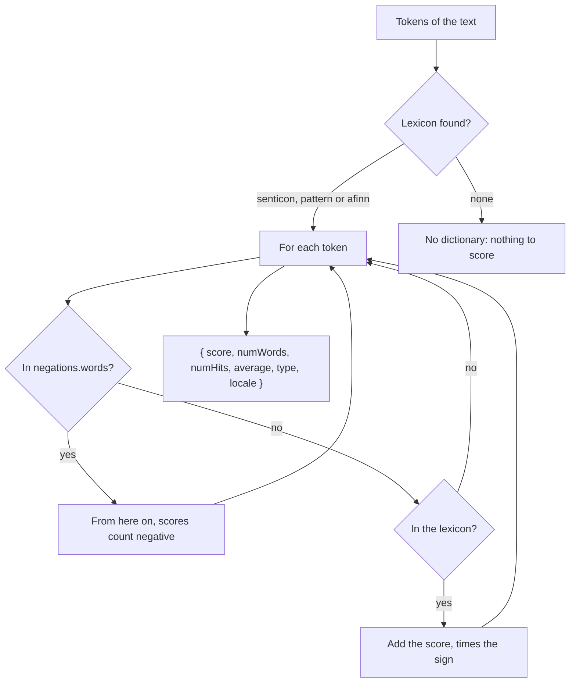

# SentimentJa

|                   |                                 |
| ----------------- | ------------------------------- |
| **Object**        | `SentimentJa` (not a class)     |
| **Container key** | `sentiment-ja`                  |
| **File**          | `src/sentiment/sentiment_ja.ts` |

The Japanese configuration the sentiment analyzer reads. Unlike the other modules of the
package it is a plain object, registered with `container.register`.

## Structure

```js
export default {
  afinn: undefined,
  pattern: undefined,
  senticon: undefined,
  negations, // from negations_ja.json
};
```

| Field      | Meaning                                                    | Japanese       |
| ---------- | ---------------------------------------------------------- | -------------- |
| `afinn`    | words with an integer score, positive or negative          | not supplied   |
| `pattern`  | a Pattern-style lexicon                                    | not supplied   |
| `senticon` | a Senticon lexicon                                         | not supplied   |
| `negations`| `{ words: string[] }`, the words that flip the polarity    | an empty list  |

**No lexicon ships for Japanese**, so out of the box the analyzer has nothing to score with.
The object is a place to plug one in.

## How the analyzer uses it

`SentimentAnalyzer` (`@nlpjs-neo/sentiment`) asks the container for `sentiment-<locale>` and
takes the first lexicon it finds, preferring `senticon`, then `pattern`, then `afinn`.



A negation word flips the sign for **every scored token after it**, not only the next one, and
it counts as a hit.

## Registration

`LangJa` registers the object itself:

```js
// inside LangJa.register(container)
container.register('sentiment-ja', SentimentJa);
```

## Supplying a lexicon

Register your own object under the same key, after `LangJa`. It replaces the default one and
leaves the shared export alone.

```js
import { Container } from '@nlpjs-neo/core';
import { LangJa } from '@nlpjs-neo/lang-ja';

const container = new Container();
container.use(LangJa);

container.register('sentiment-ja', {
  afinn: {
    嬉しい: 3,
    悲しい: -3,
    良い: 2,
    悪い: -2,
    最高: 4,
    最悪: -4,
  },
  negations: { words: ['ない', 'ません', 'なかった', 'ず', 'ぬ'] },
});
```

The keys have to match the tokens the analyzer receives, so use the same tokenizer and the
same script for the lexicon and for the text.

Editing `SentimentJa` in place also works, but the object is shared by every container in the
process:

```js
import { SentimentJa } from '@nlpjs-neo/lang-ja';

SentimentJa.negations.words = ['ない', 'ません'];
```

---

← [Back to overview](index.md)
