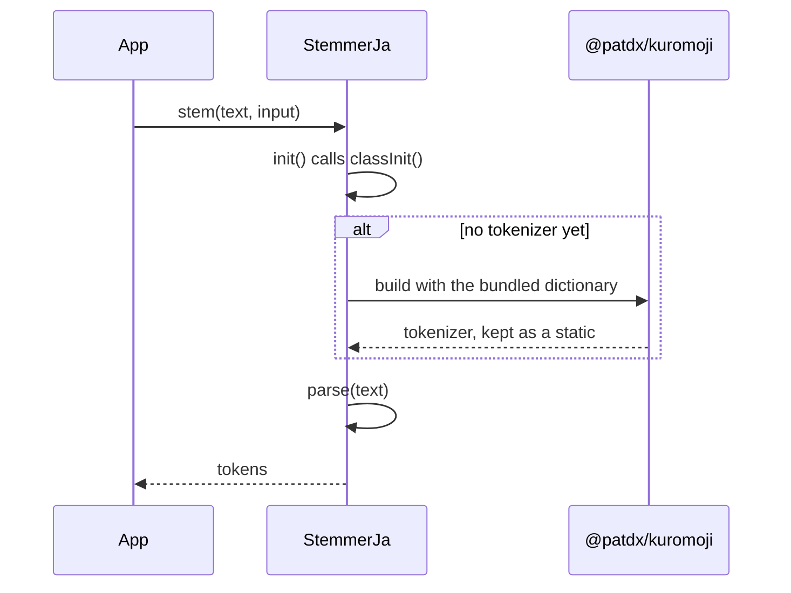
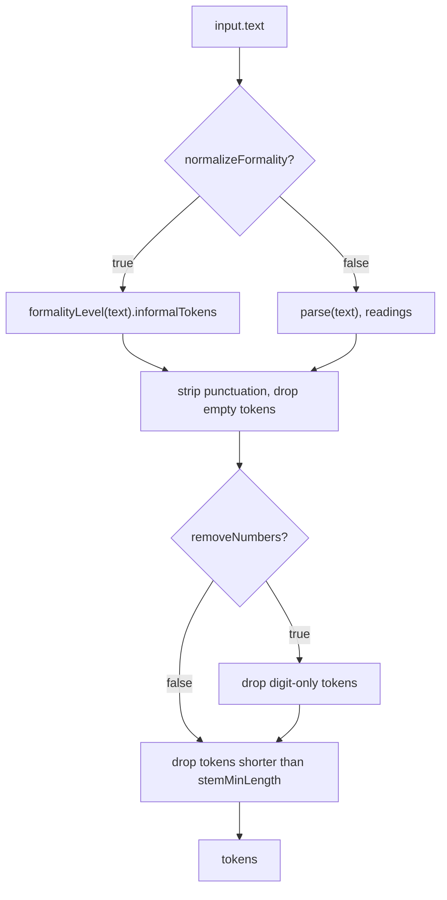
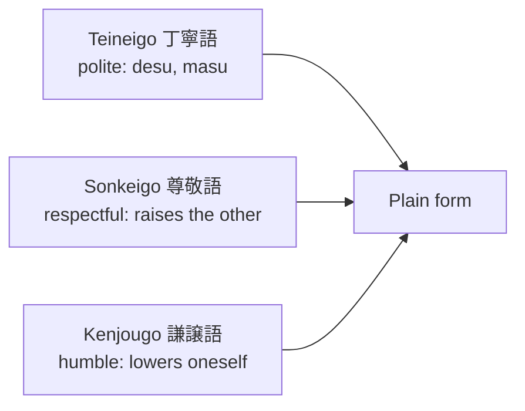

# StemmerJa

|                   |                                  |
| ----------------- | -------------------------------- |
| **Class**         | `StemmerJa`                      |
| **Extends**       | `BaseStemmer` (`@nlpjs-neo/core`) |
| **Container key** | `stemmer-ja`                     |
| **File**          | `src/stemmer-ja.ts`              |

Morphological analysis of Japanese, powered by [`@patdx/kuromoji`](https://github.com/patdx/kuromoji.js)
and its IPADIC dictionary. Japanese has no stems in the way European languages do, so the
stemmer answers the **katakana reading** of every word, in its plain form. On top of the
analysis it offers:

- hiragana and katakana conversion,
- kana to rōmaji conversion (Hepburn),
- reading normalization,
- keigo (politeness) detection, and its rewrite to the plain form.

## Initialization

The kuromoji dictionary is a few megabytes and has to be loaded before any text is parsed.
`StemmerJa` keeps one tokenizer, shared by every instance, and builds it once.



The dictionary directory is found from the entry point of `@patdx/kuromoji` (its `dict` folder
sits next to `build`), so it works under any package layout: npm, pnpm, or a monorepo.

Callers that arrive while the dictionary is loading wait for the same load. A load that fails
is not remembered, so the next call tries again.

## API

### `init()`

Answers a promise that resolves once the tokenizer is ready. `stem` calls it for you. Call it
yourself before the synchronous methods that need the tokenizer, `parse`, `formalityLevel`,
`convertToKatakana` and `convertToRomaji`.

```js
import { StemmerJa } from '@nlpjs-neo/lang-ja';

const stemmer = new StemmerJa();
await stemmer.init();
```

### Character helpers

| Method               | Answers `true` when                     |
| -------------------- | --------------------------------------- |
| `isHiraganaChar(ch)` | `ch` is in U+3040 to U+309F             |
| `isKatakanaChar(ch)` | `ch` is in U+30A0 to U+30FF             |
| `isKanaChar(ch)`     | hiragana or katakana                    |
| `isKanjiChar(ch)`    | a CJK ideograph (three ranges)          |
| `isJapaneseChar(ch)` | kana or kanji                           |
| `hasHiragana(str)`   | the string has a hiragana               |
| `hasKatakana(str)`   | the string has a katakana               |
| `hasKana(str)`       | the string has a kana                   |
| `hasKanji(str)`      | the string has a kanji                  |
| `hasJapanese(str)`   | the string has a kana or a kanji        |
| `isNumber(str)`      | the string is made only of `0` to `9`   |

### Script conversion

`toHiragana(str)` and `toKatakana(str)` shift the kana by a fixed code point distance. Anything
else is left as it is.

```js
stemmer.toHiragana('アイウエオ'); // 'あいうえお'
stemmer.toKatakana('あいうえお'); // 'アイウエオ'
```

`toRomaji(str)` writes kana in Hepburn rōmaji with the table in `src/hepburn.json`. Kanji are
not converted, so parse first when the text has any.

- A small `っ` or `ッ` doubles the consonant that follows: `ガッコウ` → `gakkou`, and before
  `ch` it becomes `t`: `マッチ` → `matchi`.
- The long vowel mark `ー` turns the vowel before it into a macron: `コーヒー` → `kōhī`.
- Only `ー` makes a macron. A long vowel spelled with kana is kept as written: `とうきょう` →
  `toukyou`.
- A syllabic `ん` before `b`, `m` or `p` is written `m`.

```js
stemmer.toRomaji('コンニチハ'); // 'konnichiha'
stemmer.toRomaji('にっぽん'); // 'nippon'
```

### `parse(text)`

Runs kuromoji and returns its tokens, after three repairs:

1. Every token gets a `reading` in katakana. A token that is not Japanese reads as itself.
2. The volitional auxiliary `う` is joined to the verb before it (`食べよう` stays one token).
3. A verb or adjective that ends in a small `っ` is joined to the verb or auxiliary after it.

A token carries the fields of kuromoji, of which these are the ones this package reads:

| Field           | Content                                    |
| --------------- | ------------------------------------------ |
| `surface_form`  | the word as written                        |
| `reading`       | its reading, in katakana                   |
| `pronunciation` | how it is pronounced                       |
| `pos`           | the part of speech, in Japanese (`動詞`)   |

```js
await stemmer.init();
stemmer.parse('東京は日本の首都です').map((token) => [token.surface_form, token.reading]);
// [['東京', 'トウキョウ'], ['は', 'ハ'], ['日本', 'ニッポン'],
//  ['の', 'ノ'], ['首都', 'シュト'], ['です', 'デス']]
```

### `convertToKatakana(text)`

Parses the text and joins the readings with a space.

```js
stemmer.convertToKatakana('東京'); // 'トウキョウ'
```

### `convertToRomaji(text)`

Parses the text, joins the readings and runs them through `toRomaji`.

```js
stemmer.convertToRomaji('東京'); // 'toukyou'
```

### `stem(text, input)`

The main entry point, and the only asynchronous method. It reads `input.text` (the `text`
argument is not used), and answers the plain-form readings of the words, without punctuation.

```js
await stemmer.stem('', { text: '私は寿司を食べます' });
// ['ワタシ', 'スシ', 'タベル']
```

Its options are read from `input`:

| Option               | Default | Effect                                                                    |
| -------------------- | ------- | ------------------------------------------------------------------------- |
| `normalizeFormality` | `true`  | rewrite keigo to the plain form. `false` keeps `タベ`, `マス`             |
| `removeNumbers`      | `true`  | drop tokens made only of digits                                           |
| `stemMinLength`      | `2`     | drop tokens shorter than this, which also removes the one-kana particles  |

```js
await stemmer.stem('', { text: '私は寿司を食べます', normalizeFormality: false });
// ['ワタシ', 'スシ', 'タベ', 'マス']

await stemmer.stem('', { text: '私は寿司を食べます', stemMinLength: 1 });
// ['ワタシ', 'ハ', 'スシ', 'ヲ', 'タベル']

await stemmer.stem('', { text: '123 寿司 456', removeNumbers: false, stemMinLength: 1 });
// ['123', 'スシ', '456']
```



## Formality level

Japanese marks politeness with **keigo (敬語)**. `StemmerJa` recognizes three levels and can
rewrite them to the plain form.



### `formalityLevel(text)`

Parses the text and looks in the readings for the keigo chains listed in `src/keigo.json`, a
trie of readings. A chain found is replaced by its plain form and counted.

It answers:

```js
{
  tokens: string[],         // the readings, as parsed
  informalTokens: string[], // the readings, with keigo replaced by the plain form
  counts: {
    keigo: number,          // every keigo found: the total of the three below, and the honorific prefix ご
    teineigo: number,
    sonkeigo: number,
    kenjougo: number,
    informal: number,       // plain markers found: ダ, ダッ and スル
  },
  isKeigo: boolean,         // keigo > 0
}
```

```js
stemmer.formalityLevel('お寿司を食べます');
// tokens:         ['オ', 'スシ', 'ヲ', 'タベ', 'マス']
// informalTokens: ['オ', 'スシ', 'ヲ', 'タベル']
// counts:         { keigo: 1, teineigo: 1, sonkeigo: 0, kenjougo: 0, informal: 0 }

stemmer.formalityLevel('お休みになる').informalTokens; // ['ネル']   (sonkeigo)
stemmer.formalityLevel('拝見する').informalTokens; // ['ミル']       (kenjougo)
stemmer.formalityLevel('元気です').informalTokens; // ['ゲンキ', 'ダ'] (teineigo copula)
```

An entry of `keigo.json` of the type `dictionary` is a plain synonym: it is replaced, but it
adds to no counter.

### `findKeigo(tokens, position)`

The lookup `formalityLevel` uses. It walks the trie from `position` and answers the longest
chain that matches, or `undefined`.

```js
stemmer.findKeigo(['タベ', 'マス'], 0);
// { value: ['タベル'], keigo: 'teineigo', length: 2 }
```

`value` is what replaces the chain, `keigo` its level and `length` the number of tokens it
covers.

---

← [Back to overview](index.md)
