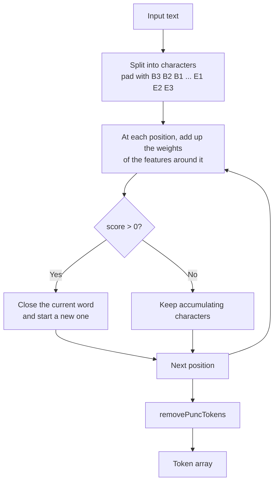

# TokenizerJa

|                   |                                 |
| ----------------- | ------------------------------- |
| **Class**         | `TokenizerJa`                   |
| **Extends**       | `Tokenizer` (`@nlpjs-neo/core`) |
| **Container key** | `tokenizer-ja`                  |
| **File**          | `src/tokenizer-ja.ts`           |

Splits Japanese text into words without a dictionary. It implements the
[TinySegmenter](http://chasen.org/~taku/software/TinySegmenter/) algorithm: a compact model
of character n-gram weights, kept in `src/japanese-rules.json`, that decides for every pair of
adjacent characters whether a word boundary lies between them.

## How it works

Japanese is written without spaces, so a boundary has to be predicted.



The score of a position starts from a bias of **-332**, and a boundary is placed when it ends
up positive. The features come from the characters around the position, their
[character types](index.md#character-types) and the outcome of the three previous decisions:

| Prefix       | Feature                                        |
| ------------ | ---------------------------------------------- |
| `UP1`-`UP3`  | one of the previous three boundary decisions   |
| `BP1`, `BP2` | two consecutive previous decisions             |
| `UW1`-`UW6`  | one character of the six-character window      |
| `BW1`-`BW3`  | two consecutive characters                     |
| `TW1`-`TW4`  | three consecutive characters                   |
| `UC1`-`UC6`  | the type of one character of the window        |
| `BC1`-`BC3`  | the types of two consecutive characters        |
| `TC1`-`TC4`  | the types of three consecutive characters      |
| `UQ1`-`UQ3`  | a previous decision with a character type      |
| `BQ1`-`BQ4`  | a previous decision with two character types   |
| `TQ1`-`TQ4`  | a previous decision with three character types |

A feature the table has no weight for counts as zero.

## API

### Constructor

```js
new TokenizerJa(container?, shouldNormalize?)
```

| Parameter         | Type        | Description                                                      |
| ----------------- | ----------- | ---------------------------------------------------------------- |
| `container`       | `Container` | The container. `LangJa` sets it when it registers the tokenizer. |
| `shouldNormalize` | `boolean`   | Whether `tokenize` normalizes the text first. Off by default.    |

### `tokenize(text, normalize?)`

Inherited from the core `Tokenizer`, which calls `innerTokenize` and caches the answer.

```js
import { TokenizerJa } from '@nlpjs-neo/lang-ja';

const tokenizer = new TokenizerJa();
tokenizer.tokenize('東京は日本の首都です');
// ['東京', 'は', '日本', 'の', '首都', 'です']
```

### `innerTokenize(text)`

The segmentation itself. It answers the tokens with the punctuation removed, and `[]` for an
empty text.

```js
tokenizer.innerTokenize('一般的にコーヌビアナイトと呼ばれる変成岩。');
// ['一般的', 'に', 'コーヌビアナイト', 'と', '呼ばれる', '変成', '岩']
```

### `ctype(char)`

Answers the [character type](index.md#character-types) of a character: `M`, `H`, `I`, `K`,
`A`, `N` or `O`.

```js
tokenizer.ctype('東'); // 'H'
tokenizer.ctype('あ'); // 'I'
tokenizer.ctype('ア'); // 'K'
tokenizer.ctype('a'); // 'A'
tokenizer.ctype('三'); // 'M'
tokenizer.ctype('5'); // 'N'
tokenizer.ctype('!'); // 'O'
```

### `removePuncTokens(tokens)`

Strips the Japanese and ASCII punctuation and whitespace from every token, then drops the
tokens that end up empty.

```js
tokenizer.removePuncTokens(['東京', '。', 'です', '！']);
// ['東京', 'です']
```

The characters it strips are:

```
＿ － ・ ， 、 ； ： ！ ？ ． 。 （ ） ［ ］ ｛ ｝ ｢ ｣ ＠ ＊ ＼ ／ ＆ ＃ ％ ｀ ＾ ＋ ＜ ＝ ＞ ｜ ～
≪ ≫ ─ ＄ ＂ _ - ･ , ､ ; : ! ? . ｡ ( ) [ ] { } 「 」 @ * / & # % ` ^ + < = > | ~ « » $ "
```

## Usage with NormalizerJa

The model was trained on regular character forms, so normalize first:

```js
import { NormalizerJa, TokenizerJa } from '@nlpjs-neo/lang-ja';

const normalizer = new NormalizerJa();
const tokenizer = new TokenizerJa();

const tokens = tokenizer.tokenize(normalizer.normalize('東京（とうきょう）は日本の首都です。'));
```

---

← [Back to overview](index.md)
